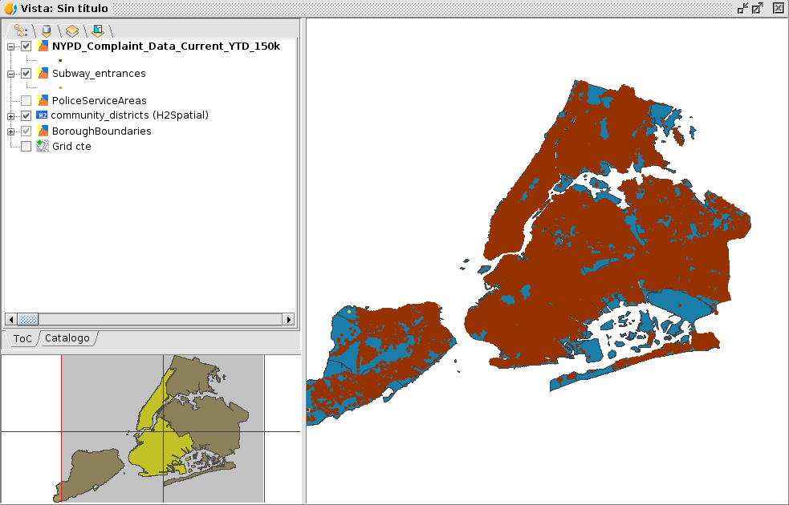
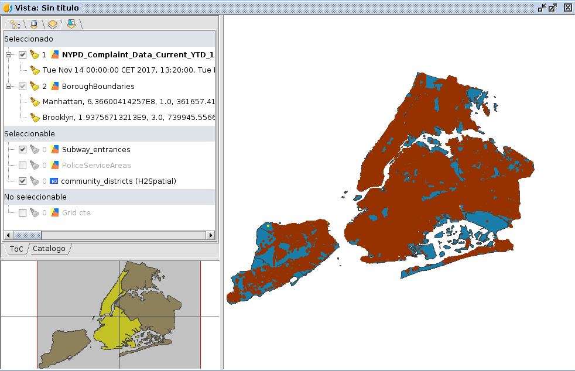

Tabbed ToC
============

Utilidad que extiende el ToC actual de la vista para permitir mostrar las capas de diversas formas:

- Según el orden en que se dibujaron

- Según la fuente

.. figure:: doc/capture_2source.png

- Según si son visibles

- Según si son seleccionables y tienen elementos seleccionados.

Para ello, sustitura el ToC base de gvSIG por uno que presente pestañas con iconos, presentando
en cada uno de las pestañas una de esas formas de ver las capas.

Puede encontrar los fuentes en:

* https://github.com/gvSIGAssociation/gvsig-desktop-scripting-TabbedToC
